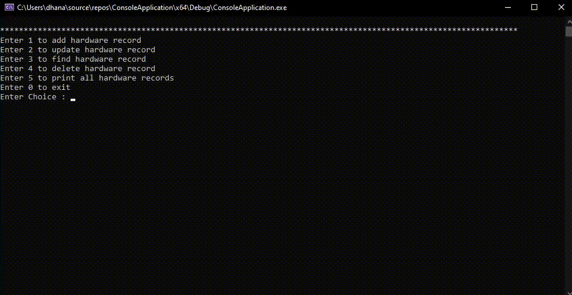
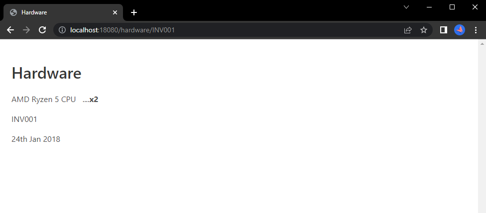

# Hardware Record Management System with REST Api

<p align="center">
    
</p>

<p align="center" width="100%">
   &nbsp;       
   &nbsp; 
   &nbsp; 
   &nbsp; 
   &nbsp; 
</p>

Create, search, update and delete hardware records in MongoDB database using simple REST Api or Console App.

<br/>

## Table of Contents

<!--ts-->
   * [**Prerequisites**](#prerequisites)
   * [**Tech**](#tech)
   * [**Documentation**](#documentation)
      * [Setup MongoDB database](#setup-mongodb-database)
      * [Download MongoDB C/C++ drivers](#download-mongodb-cc-drivers)
      * [Setup build via CMake](#setup-build-via-cmake)
      * [Execute build](#execute-build)
      * [Install & setup CROW via vcpkg](#install-and-setup-crow-using-vcpkg)
      * [Run/Debug the project](#rundebug-the-project)
      * [Create from scratch](#create-from-scratch)
      * [Method to input data](#method-to-input-data)
   * [**How to use the project**](#how-to-use-the-project) :red_circle: **Demo**:white_check_mark:
      * [Add / Insert a new record (document)](#add--insert)
      * [Update an existing document](#update)
      * [Search using invoice number](#search)
      * [Delete document of a hardware](#delete)
      * [Print collection](#print)
      * [More with API](#more-with-api)
   * [**Screenshots**](#screenshots)
<!--te-->

<br/>

## Prerequisites
Make sure you have installed all of the following prerequisites on your development machine :

* **Visual Studio 2022** - Download & install Desktop development with C++ workload.

* **MongoDB Atlas account** - Create a MongoDB Atlas account with a cluster. It provides an easy way to host and manage your data in the cloud.

* **CMake** - Download MSI x64 installer and install CMake. Make sure to add CMake to the system PATH for all users.

* **Git** - Download and install Git for Windows to clone the vcpkg repo.

<br/>

## Tech

* `Crow C++ framework v1.0-5`
* `Microsoft vcpkg`
* `Templating (Mustache)`
* `MongoDB C/C++ drivers v1.23.0|r3.7.0`

<br/>

## Documentation

There is a lot of stuff to understand so that you have the application running on the development machine. Following are the steps that explain both general concepts and development process to run the application in debugging mode :

### **Setup MongoDB database**
* Inside MongoDB cluster, create database "HardwareRecords" with collection "HardwareCollection".
* Get the connection string (URI) to the cluster and create a new environment variable with key as `MONGODB_URI` and value as the connection string (URI).
* Create new user with password and add password to the URI string.
* Whitelist IP address of the development machine.

<br/>

### **Download MongoDB C/C++ drivers**
* Download and extract seperate release tarball for C & C++ drivers :
   * **C driver** - extract it to `C:\Repos\mongo-c-driver-1.23.0`.
   * **C++ driver** - extract it to `C:\Repos\mongo-cxx-driver-r3.7.0`.

<br/>

### **Setup build via CMake**
* **C driver** - Navigate to `C:\Repos\mongo-c-driver-1.23.0\cmake-build` and run the below command using CMake in powershell/terminal as an administrator :
   ```powershell
   cmake -G "Visual Studio 17 2022" -A x64 -S "C:\Repos\mongo-c-driver-1.23.0" -B "C:\Repos\mongo-c-driver-1.23.0\cmake-build"
   ```
* **C++ driver** - Navigate to `C:\Repos\mongo-cxx-driver-r3.7.0\build` and run the below command via CMake in powershell/terminal as an administrator :
   ```powershell
   cmake .. -G "Visual Studio 17 2022" -A x64 -DCMAKE_CXX_STANDARD=17 -DCMAKE_CXX_FLAGS="/Zc:__cplusplus /EHsc" -DCMAKE_PREFIX_PATH=C:\mongo-c-driver -DCMAKE_INSTALL_PREFIX=C:\mongo-cxx-driver
   ```

<br/>

### **Execute build**
* **C driver** - Under `C:\Repos\mongo-c-driver-1.23.0\cmake-build` run the below command in powershell/terminal as an administrator to build and install the driver :
   ```powershell
   cmake --build . --config RelWithDebInfo --target install
   ```
* **C++ driver** - Under `C:\Repos\mongo-cxx-driver-r3.7.0\build` run the below command in powershell/terminal as an administrator to build and install the driver :
   ```powershell
   cmake --build . --target install
   ```

<br/>

### **Install and setup Crow using vcpkg**
* Clone the vcpkg repo :
   ```bash
   git clone https://github.com/Microsoft/vcpkg.git
   ```
* Run the bootstrap script in powershell/terminal as an administrator to build vcpkg :
   ```powershell
   .\vcpkg\bootstrap-vcpkg.bat
   ```
* Install Crow libraries for the project :
   ```powershell
   vcpkg install crow
   ```
* Link vcpkg with existing installation of Visual Studio 2022 :
   ```powershell
   vcpkg integrate install
   ```

<br/>

### **Run/Debug the project**
* Clone repository or download [ConsoleApplication](ConsoleApplication.zip) and [RestApi](RestApi.zip) .zip files.
* Extract both to open `ConsoleApplication.sln` and `RestApi.sln` using Visual Studio.
* Run both projects using `Local Windows Debugger`.

<br/>

### **Create from scratch**
* Create a new project in Visual Studio with template `Console App`.
* Configure your new project with project name `ConsoleApplication`.
* Open project properties. On the dialog box that appears, in the Configuration Properties, set C/C++ as follows :
   - **General** - add Additional Include Directories `C:\mongo-cxx-driver\include\mongocxx\v_noabi;C:\mongo-cxx-driver\include\bsoncxx\v_noabi;C:\mongo-c-driver\include\libmongoc-1.0;C:\mongo-c-driver\include\libbson-1.0;%(AdditionalIncludeDirectories)`.
   - **Language** - change the C++ Language Standard to C++17.
   - **Command Line** - add `/Zc:__cplusplus` in the Additional Options field.
* In the Configuration Properties, go to linker input and add the driver libs in Additional Dependencies section - `C:\mongo-c-driver\lib\bson-1.0.lib;C:\mongo-c-driver\lib\mongoc-1.0.lib;C:\mongo-cxx-driver\lib\bsoncxx.lib;C:\mongo-cxx-driver\lib\mongocxx.lib;%(AdditionalDependencies)`.
* In the Configuration Properties, go to Debugging and add Environment path to the driver executables - `PATH=C:\mongo-c-driver\bin;C:\mongo-cxx-driver\bin`.
* Apply changes to the dialog.
* Add `ConsoleApplication.cpp` to project with the same file available in repository [`ConsoleApplication.cpp`](Source%20Files/ConsoleApplication/ConsoleApplication.cpp).
* Add header file to the project from the repository [`Methods.h`](Source%20Files/ConsoleApplication/Methods.h).
* Now debug/run the project to view the final build.

> **Note**
> Follow same process for `RestApi` project.

<br/>

### **Method to input data**
The user can input data in 2 ways :
* Using console interface through `ConsoleApplication.exe`.
* Via `RestApi` endpoints through Postman.

<br/>

## How to use the project
The functionalities of the project are explained below :

### **Add / Insert**
Create a new document into collection.
   * **Console** - Select 1st option
   

   * **API** - Endpoint : `localhost:18080/api/addNew`
   

<br/>

### **Update**
The user can modify any document data by passing invoice number.
   * **Console** - Select 2nd option
   

   * **API** - Endpoint : `localhost:18080/api/update/KEY/VALUE`
      * KEY : Select key you want to update : `brand` | `dateOfPurchase` | `unitsSold`
      * VALUE : It should not contain any whitespace.

   * 

<br/>

### **Search**
Find the hardware using invoice.
   * **Console** - Select 3rd option
   

   * **API** - Endpoint : `localhost:18080/api/find`
   

<br/>

### **Delete**
Delete the hardware from collection via invoice.
   * **Console** - Select 4th option
   

   * **API** - Endpoint : `localhost:18080/api/delete`
   

<br/>

### **Print**
Print all the documents available at once.
   * **Console** - Select 5th option
   

   * **API** - Endpoint : `localhost:18080/api/hardwares`
   

<br/>

### **More with API**
* By following the route `http://localhost:18080/hardwares` in the browser, all documents are rendered on screen using Bulma(CSS framework) for a better user experience.
   

* Use the route `http://localhost:18080/hardware/INVOICE` in the browser, to search for a document by replacing INVOICE in url with the document invoice number.
   

<br/>

## Screenshots


<br />


